# 基于总能量和L1航迹跟踪控制的固定翼模态控制策略 Control Strategy for Fixed-Wing Mode Based on Total Energy and L1 Trajectory Tracking

## 固定翼无人机六自由度动力学模型 Six-DOF Dynamic Model of a Fixed-Wing UAV

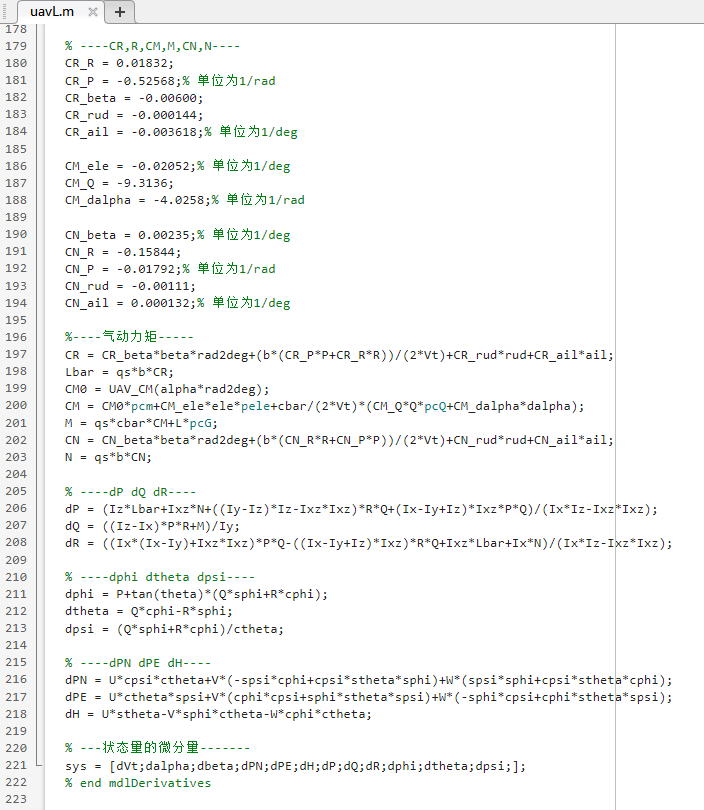

## 纵向总能量控制器设计 Longitudinal Total Energy Control Strategy

### 控制框图 Control Block Diagram

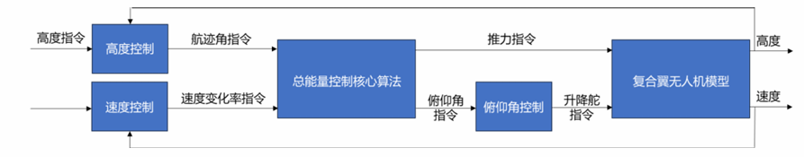

### MATLAB/Simulink控制框图  MATLAB/Simulink Implementation of the Control Block Diagram

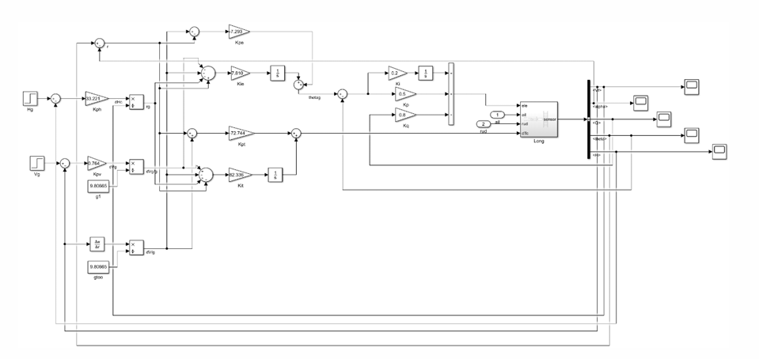

### 速度阶跃信号下的系统响应曲线 System Response to a Step Command in Velocity

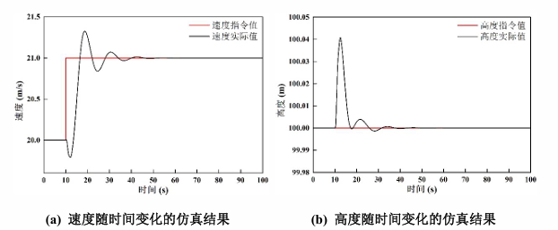

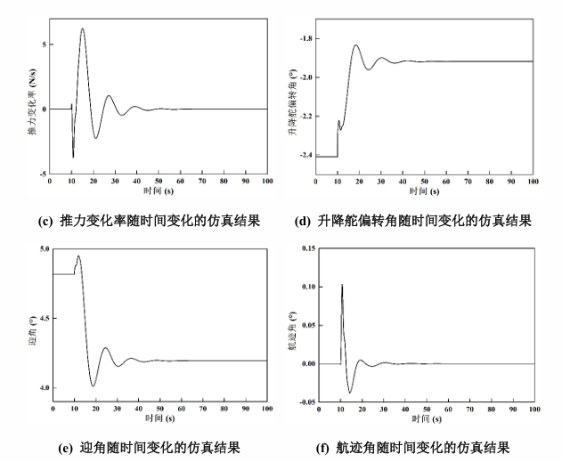

### 高度阶跃信号下的系统响应曲线 System Response to a Step Command in Altitude

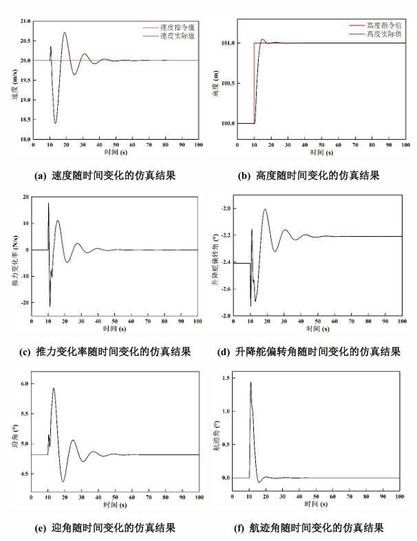

### 与PID控制高度和速度阶跃信号下的仿真结果对比 Comparison of Simulation Results with PID Control under Step Commands in Altitude and Velocity

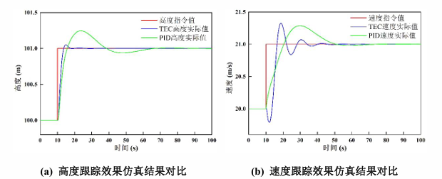

## 横侧向 L1 航迹跟踪控制策略 Lateral–Directional L1 Trajectory Tracking Control Strategy

### 控制框图 Control Block Diagram

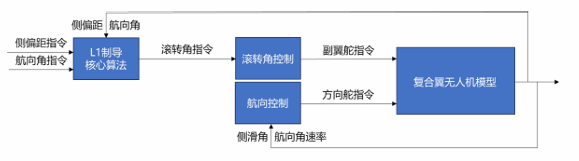

### MATLAB/Simulink控制框图 MATLAB/Simulink Implementation of the Control Block Diagram

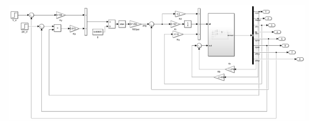

### 侧偏距阶跃信号下的系统响应曲线 System Response to a Step Command in Cross-Track Error

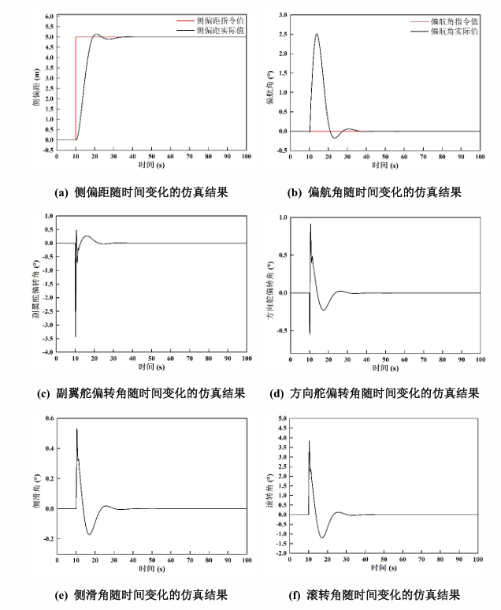

### 与PID控制侧偏距阶跃信号下的仿真结果对比 Comparison of Simulation Results with PID Control under a Step Command in Cross-Track Error

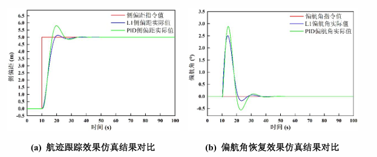
